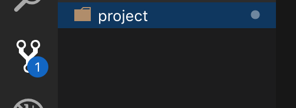
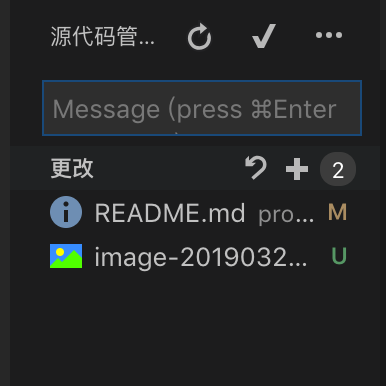
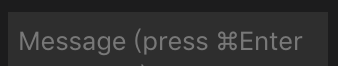
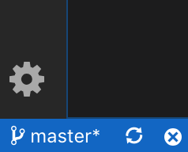
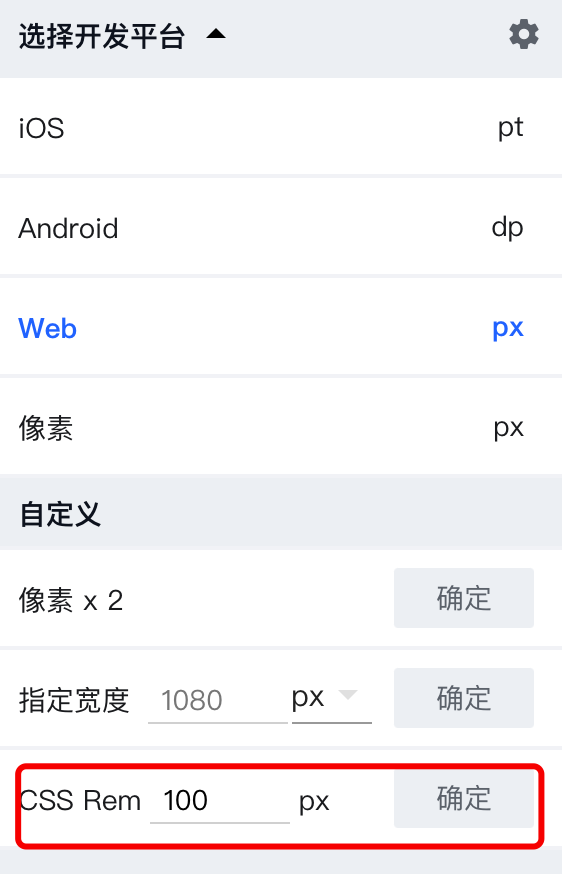

## overwrite
> 之前小组里上传github很慢，所以提交都在gitee上。
> 这次将最后的代码再转到这边
Link: `https://gitee.com/wyswill/project.git`

## 人员分工
| 王岩松 |                        |
| ------ | ---------------------- |
| 李亚雷 | 播放、登陆、分享、计时 |
| 王吉祥 | 我、引导1-3、添加课程  |
| 李玲   |                        |

## 编写要求

统一使用vscode

初始化项目：

​	git clone https://gitee.com/wyswill/project.git

​	把下载下的project拉到vscode里。

​	在自己对应的文件夹里编写代码

## vscode 提交代码

​	修改代码后点击这里

​	

点击➕将修改提交到暂存区

给每个更改添加名字

点击左下角的图标进行提交

这个图标

这个是同步图标，如果本地有修改就提交到github，github有更改的话就更新自己的本地仓库Ï

## 项目技术栈

vue / vue-router / vuex / element-ui

## 特别说明

像素单位使用rem

基本的fent-size是100px

 ### 插件

蓝湖ps插件

确定

## 图片存放

统一放在 assets 文件夹里

## ps 2019 下载地址

链接：https://pan.baidu.com/s/1HNBKHQJI9r21oRoevoWk0Q 
提取码：7vn1 
复制这段内容后打开百度网盘手机App，操作更方便哦

